# Identificação do modelo longitudinal a partir dos logs

Como sair de um punhado de arquivos `car.csv` e chegar numa equação que prevê o
carro. O objetivo aqui não é o resultado — é o **método**, para você repetir
sozinho quando mudar a cena, o carro ou a disciplina.

Scripts relacionados: [`analise_log.py`](analise_log.py) (inspeção de um ensaio),
[`identifica.py`](identifica.py) (ajuste **em etapas** coast→c,a₀ / motor→K, + validação — §7.4),
[`melhora.py`](melhora.py) (análise de resíduo e SINDy) e
[`figuras.py`](figuras.py) (gera as figuras deste documento).

---

# Parte 0 — O básico

Esta parte não assume nada. Se você já sabe o que é uma derivada e a segunda lei
de Newton, pode pular para a Parte I.

## 0.1 Velocidade, aceleração e o pontinho

O carro tem uma **posição** (onde ele está), que muda com o tempo. A taxa dessa
mudança é a **velocidade**: se a posição muda 1 metro a cada segundo, a
velocidade é 1 m/s.

A velocidade também muda com o tempo. A taxa *dessa* mudança é a **aceleração**:
se a velocidade sobe de 1 para 2 m/s em um segundo, a aceleração é 1 m/s²
(lê-se "um metro por segundo, por segundo" — ganhou 1 m/s a cada segundo).

O pontinho em cima da letra significa exatamente isso: "a taxa com que isso
muda por segundo".

```
v    = velocidade          [m/s]
v̇    = aceleração          [m/s²]     (lê-se "v ponto")
ẍ    = a mesma aceleração, escrita a partir da posição x
```

Na prática, com uma tabela de números, a derivada é uma subtração e uma divisão:

```
t = 0,50 s → v = 0,394 m/s
t = 1,00 s → v = 0,835 m/s

v̇ = (0,835 − 0,394) / (1,00 − 0,50) = 0,88 m/s²
```

É a **inclinação** da curva de velocidade. Subida íngreme = acelerando forte.
Curva plana = velocidade constante. Descendo = freando.

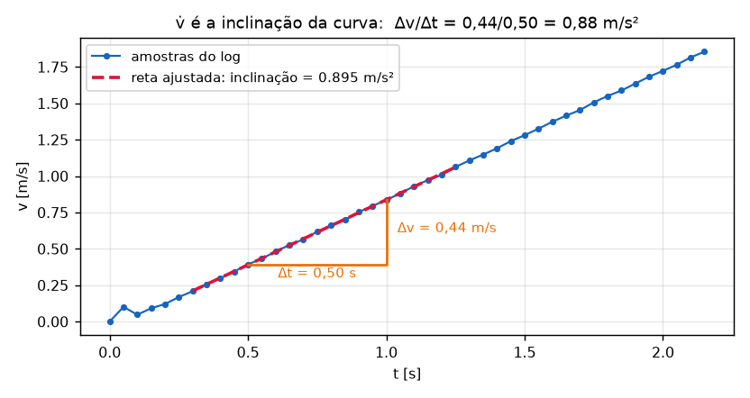

## 0.2 A segunda lei de Newton

> **Força = massa × aceleração.**  `F = m·a`

Traduzindo: o quanto um objeto ganha velocidade depende de duas coisas — o
quanto você empurra, e o quanto ele é pesado. Empurrar duas vezes mais forte
acelera duas vezes mais. O mesmo empurrão num objeto duas vezes mais pesado
acelera metade.

Reescrevendo com o pontinho e isolando a aceleração:

```
m·v̇ = F           →        v̇ = F/m
```

Quando há **várias** forças agindo ao mesmo tempo, elas se somam (as que
empurram para frente contam positivo, as que seguram contam negativo). No
carro são quatro:

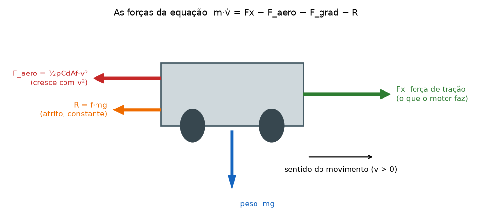

```
m·v̇  =    Fx    −   F_aero   −   F_grad   −    R
          ↑          ↑            ↑            ↑
       o motor    o ar        a ladeira    o atrito
```

| força | o que é, em português | quando importa |
|---|---|---|
| `Fx` | o empurrão do motor através das rodas | sempre que você acelera ou freia |
| `F_aero = ½ρCdAf·v²` | o ar batendo no carro | só em velocidade alta (cresce com o **quadrado** de v) |
| `F_grad = mg·senθ` | a gravidade puxando ladeira abaixo | só se a pista for inclinada (`θ` é o ângulo) |
| `R = f·mg·cosθ` | pneu deformando, rolamento, transmissão | sempre, e com intensidade quase constante |

As três últimas são **perdas**: elas entram com sinal negativo porque seguram o
carro. Só o `Fx` é seu.

## 0.3 Dividindo por m: de forças para acelerações

Trabalhar com forças em newtons é incômodo porque tudo depende da massa.
Dividindo a equação inteira por `m`, tudo vira aceleração em m/s², que é o que
você realmente enxerga no gráfico:

```
v̇ = Fx/m − (ρCdAf/2m)·v² − g·senθ − f·g·cosθ
```

Repare que cada grupo entre parênteses é só **um número fixo** multiplicando
alguma coisa. Dar um nome curto a cada número deixa a equação legível:

```
v̇  =  K·u   −   c·v²   −   a₀
```

## 0.4 O que é cada letra

**`u` — o seu comando.** É o que o seu código escreve quando chama
`car.set_u(0.5)`. Neste projeto ele está em unidade de aceleração, m/s²: `u = 1`
significa "por favor acelere a 1 m/s²". É o acelerador e o freio num número só —
positivo acelera, negativo freia.

**`K` — o ganho.** Quanto do que você pediu realmente acontece. `K = 1` significa
"pedi 1 m/s², recebi 1 m/s²". `K = 0,8` significaria que 20% se perdem no
caminho (transmissão, patinação). É um número **sem unidade**, uma razão entre o
que saiu e o que foi pedido. Identificamos `K ≈ 1,00`, ou seja, o comando é
entregue quase inteiro.

**`c` — o coeficiente de arrasto.** Multiplica `v²`, então o efeito **cresce com
o quadrado da velocidade**: dobrar a velocidade quadruplica essa perda. A 1 m/s
ele tira 0,004 m/s² (nada); a 6 m/s tira 0,15 m/s² (já se nota). Unidade: 1/m.

**`a₀` — o atrito seco.** Uma perda de tamanho **fixo**, que não depende da
velocidade: 0,095 m/s² sempre, andando devagar ou rápido. É o custo de rolar.
Unidade: m/s², igual à aceleração.

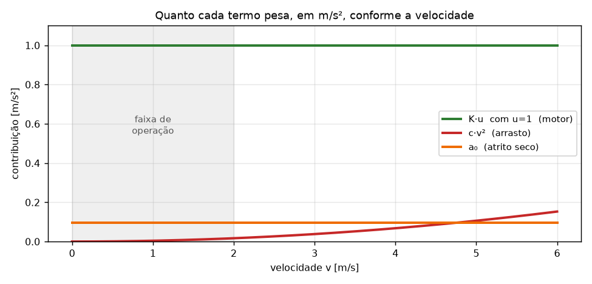

O gráfico mostra por que, na faixa em que o carro vai operar (0 a 2 m/s, área
cinza), o arrasto é irrelevante e o atrito seco é o que importa.

## 0.5 Por que `|v|` e `sign(v)`

`sign(v)` é uma função que vale `+1` se `v` é positivo e `−1` se é negativo. Ela
aparece porque **atrito e arrasto sempre se opõem ao movimento**: se o carro vai
para frente eles puxam para trás, se vai para trás eles puxam para frente.

Sem esse detalhe, o modelo diria que o atrito empurra o carro de ré para trás,
acelerando-o — o que é absurdo. Por isso a forma final é:

```
v̇ = K·u − c·v·|v| − a₀·sign(v)
```

(`v·|v|` é o mesmo que `v²` mas guardando o sinal: vale `+4` a 2 m/s e `−4` a
−2 m/s.)

## 0.6 O que significa "identificar"

Você **propõe** a forma da equação — ela vem da física, não dos dados. Depois
usa os dados para descobrir os **números** dentro dela (`K`, `c`, `a₀`), e por
fim **testa** se essa equação prevê experimentos que ela nunca viu.

É isso que o resto do documento faz. O resultado final:

```
v̇ = 1,00·u − 0,00425·v·|v| − 0,095·sign(v)
```

Três números que descrevem o carro inteiro, com erro abaixo de 4%.

---

# Parte I — Fazendo a identificação

## 1. O que significa "identificar"

Você tem um comando `u` e uma resposta `v`. Identificar é achar a **equação
diferencial** que liga os dois, e os **números** dentro dela.

A forma da equação vem da física (Newton). Os números vêm dos dados. Essa
divisão é importante: você não "descobre" a forma olhando o gráfico — você
**propõe** uma forma e depois **testa** se ela sobrevive aos dados.

A forma, no nosso caso, é a equação de dinâmica longitudinal padrão:

```
m·ẍ = Fx − ½ρCdAf·ẋ² − mg·senθ − f·mg·cosθ
```

Dividindo por `m` e trocando `ẋ → v`:

```
v̇ = Fx/m − (ρCdAf/2m)·v² − g·senθ − f·g·cosθ
```

Como cada grupo entre parênteses é uma constante, o que temos de fato é:

```
v̇ = K·u − c·v·|v| − a₀·sign(v)
```

| símbolo | significa | vem de |
|---|---|---|
| `K` | quanto do comando vira aceleração de verdade | `Fx/m`, com `u` sendo aceleração comandada |
| `c` | perdas que crescem com a velocidade | `ρCdAf/2m` |
| `a₀` | perda constante, sempre contra o movimento | `f·g·cosθ` (mais `g·senθ` se houver rampa) |

Os `|v|` e `sign(v)` existem porque atrito e arrasto **sempre freiam**: eles
trocam de sinal quando o carro troca de sentido. Sem isso o modelo aceleraria o
carro de ré, o que é absurdo.

---

## 2. A ideia central: isolar um parâmetro por vez

Cada parâmetro domina em uma condição diferente. É isso que torna a
identificação possível:

| parâmetro | domina quando | como isolar |
|---|---|---|
| `a₀` | `u = 0` e `v` baixa | deixe o carro em roda-livre devagar |
| `c` | `v` alta | compare duas velocidades bem diferentes com o mesmo `u` |
| `K` | `u` grande | qualquer trecho com comando, depois de conhecer os outros dois |

**Se você não criar essas condições no ensaio, não existe conta que resolva.**
Esse é o erro mais comum: rodar um único degrau e tentar extrair três
parâmetros. Não dá — e o pior é que o ajuste *parece* funcionar (seção 6).

Um ensaio bem montado tem um trecho dedicado a cada parâmetro:

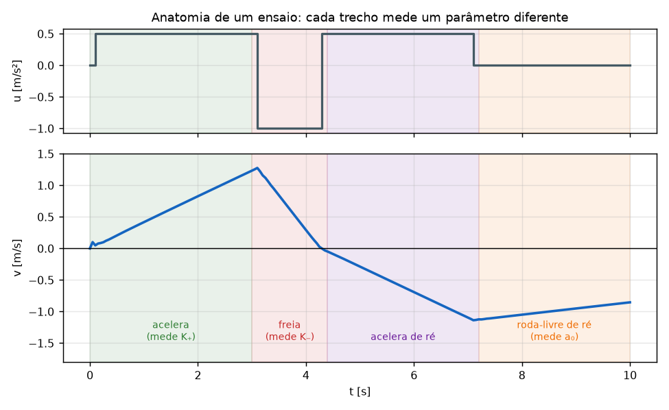

---

## 3. Fazendo na mão, com duas equações

Não precisa de biblioteca. Precisa de dois pontos em condições diferentes.

### Passo 0 — medir uma aceleração

`v̇` é a inclinação da curva de velocidade. Dois pontos do log bastam:

```
t = 0,50 s → v = 0,394 m/s
t = 1,00 s → v = 0,835 m/s

v̇ = (0,835 − 0,394) / (1,00 − 0,50) = 0,88 m/s²
```

Na prática use `np.polyfit(t, v, 1)[0]` num trecho inteiro em vez de dois
pontos: o ruído do sensor some na média.

### Passo 1 — `a₀` no trecho de roda-livre

Trecho com `u = 0`, `v ≈ 1,1 m/s`, medido `v̇ = −0,099 m/s²`:

```
−0,099 = K·0 − c·(1,1)² − a₀
−0,099 = −1,21·c − a₀
```

Se `c` for pequeno (vamos confirmar), `a₀ ≈ 0,099 m/s²`.

### Passo 2 — `c` comparando duas velocidades

Ensaio com `u = 1,0` mantido, dividido em janelas:

```
v ≈ 1,04 m/s → v̇ = 0,890
v ≈ 5,94 m/s → v̇ = 0,765
```

Escreva o modelo nas duas e **subtraia**. `K` e `a₀` são iguais nas duas
linhas, então eles se cancelam:

```
0,890 = K − 1,08·c − a₀
0,765 = K − 35,3·c − a₀
-----------------------------  (subtraindo)
0,125 = 34,2·c   →   c = 0,00365
```

Confirma o passo 1: `1,21 × 0,00365 = 0,004`, desprezível.

> **Esse é o truque que vale levar para qualquer identificação:** monte duas
> medições que diferem em *um* efeito só, e subtraia para matar todo o resto.

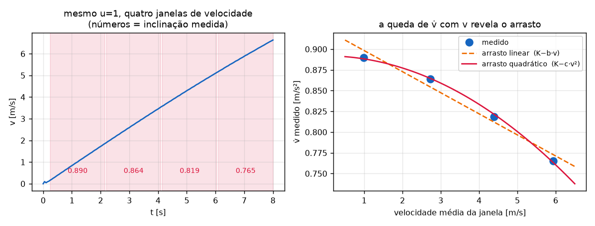

No painel da esquerda, as quatro janelas do mesmo ensaio (`u = 1` o tempo todo)
com a inclinação medida em cada uma. No da direita, essas quatro inclinações
contra a velocidade: a curva quadrática passa pelos pontos, a reta não.

### Passo 3 — `K` de volta na primeira equação

```
K = 0,890 + 1,08·(0,00365) + 0,099 = 0,993
```

### Passo 4 — repita para o outro sentido do comando

`u = −0,5`, `v̄ = 0,50`, medido `v̇ = −0,593`:

```
−0,593 = K₋·(−0,5) − 0,00365·(0,25) − 0,099
0,5·K₋ = 0,593 − 0,001 − 0,099 = 0,493
K₋ = 0,986
```

Quatro contas de papel, quatro parâmetros. O script faz o mesmo com 800 pontos.

---

## 4. Fazendo com mínimos quadrados

Repare que o modelo é **linear nos parâmetros**, mesmo tendo `v²` dentro. Isso
é o que permite resolver tudo de uma vez. Escreva cada amostra como uma linha:

```
v̇ᵢ = K₊·(uᵢ se uᵢ>0) + K₋·(uᵢ se uᵢ<0) + c·(−vᵢ|vᵢ|) + a₀·(−sign(vᵢ))
```

Em forma matricial, `b = A·p`:

```
    ⎡ v̇₁ ⎤   ⎡ u₁⁺   u₁⁻   −v₁|v₁|   −sign(v₁) ⎤   ⎡ K₊ ⎤
    ⎢ v̇₂ ⎥ = ⎢ u₂⁺   u₂⁻   −v₂|v₂|   −sign(v₂) ⎥ · ⎢ K₋ ⎥
    ⎢ ⋮  ⎥   ⎢  ⋮     ⋮        ⋮          ⋮     ⎥   ⎢ c  ⎥
    ⎣ v̇ₙ ⎦   ⎣ uₙ⁺   uₙ⁻   −vₙ|vₙ|   −sign(vₙ) ⎦   ⎣ a₀ ⎦
```

- **`b`** é o que você mediu (a aceleração em cada amostra).
- **Cada coluna de `A`** é "quanto aquele parâmetro contribuiria, se valesse 1".
- **`p`** são os parâmetros que você quer.

Com 800 linhas e 4 incógnitas o sistema é impossível de resolver exatamente
(ruído). `lstsq` acha o `p` que minimiza a soma dos erros ao quadrado:

```python
A = np.c_[np.where(u > 0, u, 0.0),
          np.where(u < 0, u, 0.0),
          -v * np.abs(v),
          -np.sign(v)]
p, *_ = np.linalg.lstsq(A, vd, rcond=None)
Kp, Km, c, a0 = p
```

São as mesmas quatro contas da seção 3, feitas simultaneamente e com todo o
dado disponível. Se você entendeu a subtração do passo 2, entendeu `lstsq`: ele
é a versão automática disso.

> **Atenção (ver §7.4):** jogar *todas* as amostras — coast e motor — num lstsq
> único como acima enviesa o `c`. O `identifica.py` usa este mesmo `lstsq`, mas
> aplicado **em duas etapas** (coast → `c, a₀`; motor → `K`), justamente para
> isolar cada parâmetro na condição em que ele domina. A conta é a de cima; a
> ordem em que se aplica é que muda.

---

## 5. Preparando os dados (a parte que ninguém conta)

Antes de ajustar qualquer coisa, três limpezas obrigatórias neste projeto:

### 5.1 A coluna `v` do log não tem sinal

[`fva_car/car.py`](fva_car/car.py) calcula `v = gear * norm(lin)`. O sinal vem
da **marcha**, não do movimento. Se o carro andar de ré com a marcha em `+1`, a
coluna `v` fica positiva com o carro indo para trás. Reconstrua da posição:

```python
passo = np.hypot(np.diff(x), np.diff(y)) / np.diff(t)
v = np.r_[0.0, passo * np.sign(np.diff(x))]
```

### 5.2 Corte depois da inversão de sentido

Quando o carro inverte sem trocar a marcha, a compensação de atrito do
simulador passa a empurrar **a favor** do movimento. O modelo não descreve mais
nada ali. `identifica.py` detecta e corta automaticamente.

### 5.3 Descarte o carro parado

Com `|v| < 0,1 m/s` entra atrito estático, que é um fenômeno diferente e não
está no modelo. Mantê-lo estraga a estimativa de `a₀`.

---

## 6. As armadilhas (todas foram cometidas neste projeto)

### 6.1 Parâmetro que falta não some — se esconde

Primeiro modelo tentado: `v̇ = K·u − b·v`, sem o `a₀`. Resultado:
`K₊ = 0,93` e `K₋ = 1,07`, e a conclusão de que "frear é 18% mais forte que
acelerar". **Falso.** Os 0,1 m/s² do atrito seco ajudam a frenagem e atrapalham
a aceleração; sem um termo para ele, a diferença foi parar nos ganhos. Com `a₀`
no modelo: `K₊ = 1,00`, `K₋ = 1,00`.

> Um parâmetro ausente contamina os presentes, e eles continuam parecendo
> razoáveis. O sintoma é assimetria ou dependência inexplicada.

### 6.2 Ajuste bom não é evidência de modelo certo

O trecho de roda-livre entre 1,2 e 0,9 m/s foi ajustado por uma exponencial
`v = v₀·e^(−t/τ)` com τ = 11,8 s e resíduo ótimo. Conclusão: sistema de
primeira ordem com polo em −0,085.

Só que uma **reta** ajustava o mesmo trecho ainda melhor (resíduo 0,0044 contra
0,0056). Numa faixa estreita, exponencial e reta são indistinguíveis.

O que separou os dois foi um ensaio até 6 m/s. O modelo de primeira ordem
previa `v̇ = 0,89 − 0,085×5,94 = 0,39 m/s²`. Medido: **0,765**. Refutado por um
fator de 2.

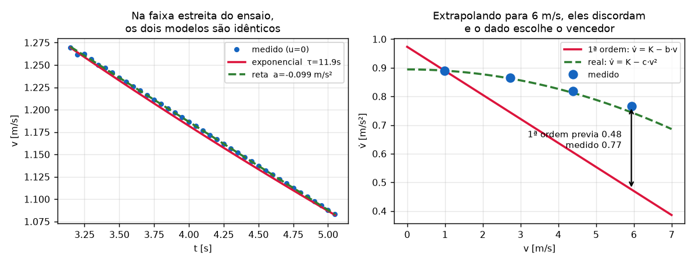

À esquerda, os dois modelos em cima do mesmo trecho de roda-livre: são
indistinguíveis a olho nu, e o resíduo até favorece a reta. À direita, os mesmos
dois modelos extrapolados até 6 m/s, com os pontos medidos: a primeira ordem
previa 0,48 m/s² onde o carro entregou 0,77.

> Dois modelos com física completamente diferente passam no mesmo teste quando
> o teste é estreito demais. **Excite o sistema onde eles discordam.**

### 6.3 Nunca ajuste atravessando uma saturação

No ensaio de `u = −1,0` o carro freia, inverte e estabiliza num creep de
−0,165 m/s. Ajustar uma reta no trecho inteiro dá `dv/dt = −0,05`, porque os
5 s de platô achatam tudo. O valor correto, só na parte que responde, é
`−1,06`. `analise_log.py` isola a parte útil por `|dv/dt| > 20%` do máximo.

### 6.4 Não misture ensaios de condições diferentes

Ver seção 8.

---

## 7. Validação: o teste que realmente vale

O ajuste acerta a **derivada**, amostra a amostra, com a velocidade real dada
de graça a cada passo. É um teste fácil de passar.

A validação de verdade é **simular em malha aberta**: pegue só a velocidade
inicial e a sequência de comandos, integre o modelo até o fim do ensaio, e veja
o quanto ele descolou. Aqui não há correção: o erro de cada passo se acumula.

```python
def simula(t, u, v0):
    v = np.empty_like(t)
    v[0] = v0
    for i in range(len(t) - 1):
        K = Kp if u[i] > 0 else (Km if u[i] < 0 else 0.0)
        vdot = K*u[i] - c*v[i]*abs(v[i]) - a0*np.tanh(v[i]/0.05)
        v[i+1] = v[i] + vdot*(t[i+1] - t[i])
    return v
```

> O `tanh(v/0.05)` substitui o `sign(v)` na simulação. Com `sign`, a integração
> numérica fica alternando entre ±a₀ perto de `v = 0` e o resultado oscila sem
> sentido físico. O `tanh` é a mesma coisa com uma transição suave. É o mesmo
> truque que o `car.py` usa na compensação de atrito.

Resultado atual (erro máximo ao longo de ensaios de 8 s):

```
20260915_200353   rms=0,025 m/s   max=0,079 m/s   (3,0%)
20260915_200647   rms=0,021 m/s   max=0,085 m/s   (1,9%)
20260915_200750   rms=0,023 m/s   max=0,074 m/s   (4,1%)
20260915_201815   rms=0,007 m/s   max=0,036 m/s   (2,8%)
20260915_202657   rms=0,016 m/s   max=0,040 m/s   (3,1%)
20260915_203340   rms=0,014 m/s   max=0,056 m/s   (0,9%)
```

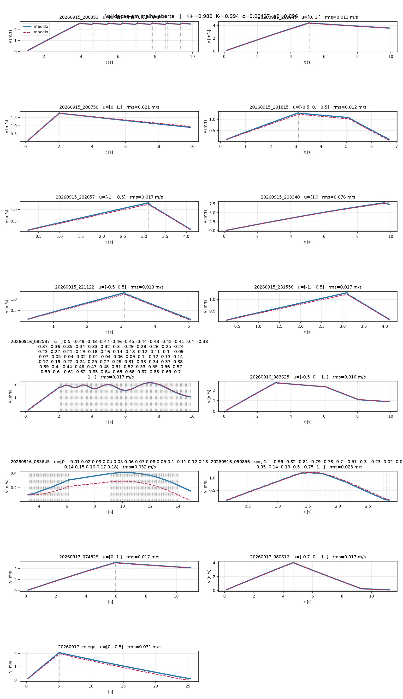

Azul é o carro, vermelho tracejado é o modelo. Em cada painel o modelo recebeu
apenas o primeiro ponto e a sequência de comandos — o resto é previsão.

Quatro números reproduzem seis ensaios independentes, de −1 a +1 em comando e
de 0 a 6,6 m/s, com menos de 4% de erro acumulado. **Isso** é um modelo
identificado.

### 7.1 Confirmação em alta velocidade (coastdown a 5 m/s)

Os ensaios acima têm coastdown limpo só até ~4 m/s, e nenhum começava a
roda-livre em velocidade alta — a faixa onde o `c·v²` finalmente pesa. O log
`20260917_074529` fechou a lacuna: aceleração a fundo (`u = 1`) até 5 m/s,
depois `u = 0`. (O carro saiu da pista em ~11,5 s; o trecho após a queda foi
cortado.)

Previsão cega, com os parâmetros de §10 **congelados** (o ensaio não entrou em
ajuste nenhum):

```
20260917_074529   coastdown 5,0 → 4,1 m/s   rms = 0,018 m/s
```

É o ensaio mais rápido do acervo e o modelo o reproduz com o mesmo ~2% dos
demais. O `c = 0,00425` — que §3 tirou de janelas até 6 m/s e §11 confirmou por
resíduo — ganhou uma previsão cega dedicada na ponta alta, justo onde os dois
modelos candidatos mais discordavam (§6.2).

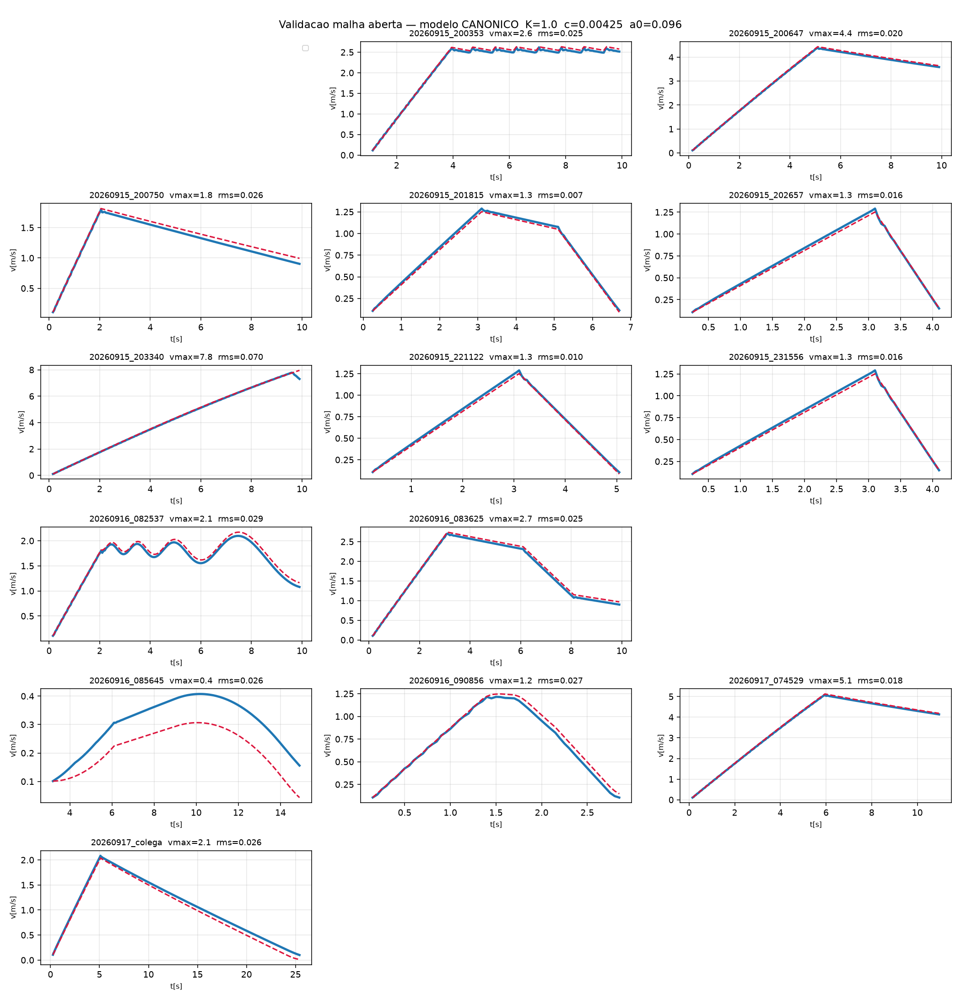

**Um alerta metodológico caiu junto.** Rodar o `identifica.py` (lstsq na
derivada) sobre o acervo atual inteiro — já com este ensaio e excluindo só a
rampa de §8 — devolve `c = 0,0078` e `a₀ = 0,078`, quase o dobro do `c`
validado. E esse ajuste prevê **pior** em malha aberta: rms médio 0,047 contra
0,024 do modelo de §10, inclusive nos próprios ensaios de alta velocidade (no
log de 5 m/s, 0,106 contra 0,018). É a §6.2 de novo, agora mordendo o nosso
próprio método: **o lstsq na derivada minimiza o resíduo de ajuste, não o erro
de previsão**. A causa exata, isolada em §7.4, são os trechos **com motor**
(u≠0) — não as transições, como eu suspeitei a princípio e o teste refutou — e
a correção é ajustar em etapas. O modelo a usar continua o de §10.

> **Lição:** um ensaio de alta velocidade não *re-identifica* o modelo — ele o
> *valida* onde antes havia extrapolação. Ajustá-lo sozinho, aliás, dá `a₀`
> negativo: um único coastdown de faixa estreita não separa `a₀` de `c` (§2),
> valha para 2 ou para 5 m/s. O valor de um ensaio novo está na *condição* nova
> (§11.2), lida por previsão cega — não em mais uma rodada do mesmo lstsq.

### 7.2 Frenagem em alta velocidade (firma o `K₋`)

O `K₋` (freando) vinha só de trechos de baixa velocidade (§3 passo 4: `u = −0,5`,
`v ≈ 0,5 m/s`). O log `20260917_080616` fecha a lacuna: acelera até 4 m/s, freia
com `u = −0,7` até quase parar (soltando antes de inverter — §6.3). Com `c` e
`a₀` do §10 fixos, o trecho de freio (`v` de 3,8 a 0,5 m/s) dá:

```
K₋ = 1,001        previsão cega do ensaio inteiro: rms = 0,027 m/s
```

Confirma o `K₋ = 0,997`, agora a partir de alta velocidade. Ajustar `K₋` e `a₀`
juntos **neste** trecho não funciona: com `u = −0,7` constante os dois ficam
colineares e o fit livre joga tudo no `a₀` (`K₋ = 0,38`, `a₀ = 0,54`) — o mesmo
padrão de §2. Por isso o `K₋` sai fixando `c, a₀` de dado independente.

### 7.3 Rampa: o modelo transfere para a subida

Até aqui `θ = 0` era medido na pista plana (§14). A cena de rampa
(`simulador_rampa.ttt`) testa o termo `mg·senθ` que sempre esteve na equação
(§0.2) e nunca tinha valido. Log `20260917_081456`: sobe a rampa sob `u = 1`,
cruza o topo e desce.

O `θ` sai por dois caminhos independentes, e batem:

```
coast subindo (u=0):   a₀ + g·senθ = 0,723   →   g·senθ = 0,627   →   θ = 3,66°
acel  subindo (u=1):   mesma cena             →   g·senθ = 0,637   →   θ = 3,72°
```

**O teste que vale é a transferência.** Acelerando *sobre* a rampa (`u = 1`,
`v ≈ 3,4 m/s`), a aceleração medida foi **0,217 m/s²**. O modelo plano **mais o
termo `g·senθ`** — com `K, c, a₀` do §10, sem reajuste nenhum — previa **0,227**,
erro de 0,010 m/s². Sem o termo de gravidade o modelo plano preveria 0,854 (4×
errado).

```
v̇ = K·u − c·v·|v| − a₀·sign(v) − g·senθ
```

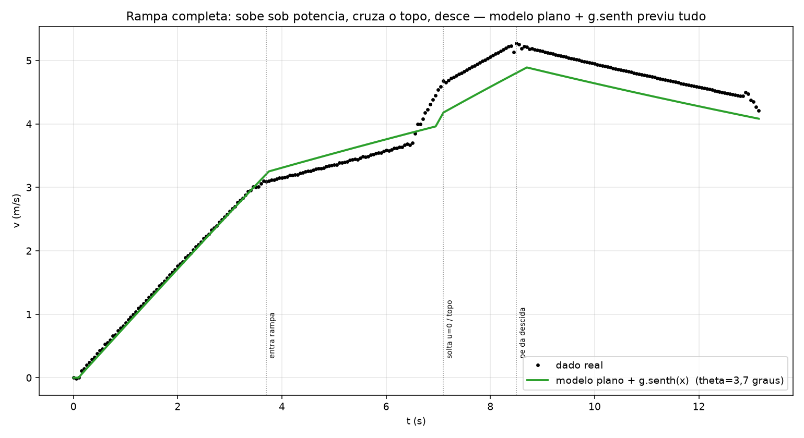

Os parâmetros da planta **não mudam com a cena** — a rampa só acrescenta o termo
de gravidade que a equação do slide já previa. É a validação de transferência
antes do hardware: trocar de piso é somar um termo conhecido, não re-identificar.

### 7.4 Por que o lstsq global erra o `c` — e o ajuste em etapas acerta

O §7.1 mostrou o lstsq global devolvendo `c = 0,0077` (validação 2× pior). A
causa não são as transições (descartá-las move o `c` em 0,00001), e sim os
trechos **com motor**: fitar `u = 0` e `u ≠ 0` na mesma conta deixa o `c` e o
`K` se compensarem, e o `c` sobe para absorver desajuste da fase acelerada.

A correção é a própria filosofia de §2 — **isolar um parâmetro por vez** — feita
em duas etapas, e é o que o [`identifica.py`](identifica.py) passou a fazer por
padrão:

1. `c` e `a₀` **só dos coastdowns** (`u = 0`, faixa larga 0,3–5 m/s), onde o
   motor sai da conta.
2. `K₊`/`K₋` **só dos trechos com motor**, com `c` e `a₀` já fixos.

O lstsq global (§4) continua sendo calculado, mas só como comparação — o script
imprime o `c` enviesado dele com o aviso de não usar. Rodado sobre o acervo
plano atual:

```
                K₊      K₋       c        a₀   | rms médio  pior
etapas        0,980   0,994   0,00427   0,0961 |   0,0224   0,0756
lstsq global  0,996   1,013   0,00769   0,0782 |   0,0458   0,1568
§10 (canônico)1,000   1,000   0,00425   0,0960 |   0,0244   0,0703
```

O ajuste em etapas **recupera o modelo do §10 sozinho** (`c = 0,00427`,
`a₀ = 0,096`) e valida melhor que os dois — enquanto o lstsq global fica 2× pior.
Não é um modelo novo: é o mesmo §10, agora reproduzível direto dos logs crus, sem
o viés do fit tudo-de-uma-vez.

> **Lição:** quando um parâmetro depende de uma condição (o `c` só aparece em `v`
> alta; o `K` só com `u ≠ 0`), jogá-los todos num lstsq único deixa que se
> compensem. Ajuste na ordem em que a física os isola, não na conveniência de uma
> matriz só.

### 7.5 O `K` não depende da velocidade (não há droop de ganho)

Última dúvida sobre o modelo em linha reta: o ganho `K` é mesmo constante, ou
cai (satura) em velocidade alta? Se caísse, o modelo esconderia isso — e é o que
fez o lstsq global parecer querer um `c` maior (§7.4). Medindo o `K₊` implícito
(`K = (v̇ + c·v|v| + a₀·sign(v)) / u`) por faixa de velocidade, só em `u = 1`,
com `c, a₀` canônicos:

```
v 0–1 m/s   K₊ = 1,002
v 1–2 m/s   K₊ = 0,987
v 2–3 m/s   K₊ = 0,991
v 3–4 m/s   K₊ = 0,992
v 4–6 m/s   K₊ = 1,000
v 6–9 m/s   K₊ = 0,76   (std 0,73 — lixo: faixa onde o carro sai da pista)
```

`K` é plano em ~1,00 de 0 a 6 m/s. O ganho é **linear e independente da
velocidade** em todo o envelope útil (o desvio em >6 m/s é dado contaminado pelo
fim de pista, não física). Fecha o item do §9 ("o mesmo `K` sai de `|u|`
diferentes?") e confirma que o `K₊ = 0,98` do ajuste em etapas é média com
ruído, não droop.

### 7.6 Longitudinal e lateral são desacoplados (o modelo vale em curva)

Todos os ensaios até aqui foram `steer = 0`. Mas a missão faz curva, e curvar
*poderia* mudar a dinâmica longitudinal (arrasto de curva, transferência de
carga, torque dividido entre tração e guinada). Era a última hipótese implícita
não testada. Log `20260917_084837`: mesma excitação da frenagem (acelera até
2,5 m/s, freia com `u = −0,7`), mas com **esterço fixo de 15°** — o carro
descreve um círculo de raio ~1,1 m, com ~3 m/s² de aceleração lateral.

A velocidade é o **módulo** da velocidade de trajetória (o `sign(dx)` da §5.1 não
vale num arco; aqui o carro só anda para frente, então o módulo basta). Comparando
`v̇` medido com o modelo de **linha reta** (§17), sem reajuste:

```
acel  (u=+1,0):   medido +0,881   modelo reto +0,894   erro 0,012 m/s²
freio (u=−0,7):   medido −0,818   modelo reto −0,806   erro 0,012 m/s²
previsão cega do ensaio inteiro (malha aberta):        rms 0,040 m/s
```

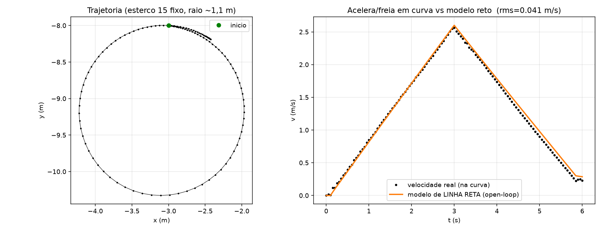

Mesmo ~1% dos ensaios em reta. **Curvar a 3 m/s² não mexe em `K`, `c` nem `a₀`** —
longitudinal e lateral são desacoplados nesta planta, e o modelo do §17 vale
virando também. A suposição de todos os ensaios `steer = 0` agora é medida, não
assumida. (O modelo *lateral* — esterço → guinada → curvatura — é outro modelo,
ainda não identificado; este ensaio só mostra que ele não contamina o
longitudinal.)

---

## 8. O ensaio que não se encaixou

O log `20260901_200913` deu **52% de erro** na validação — dez vezes pior que
todos os outros. Olhando o dado bruto:

```
t=5,40  u=0,00  v=3,171
t=6,60  u=0,00  v=2,263   ← desacelerando, normal
t=7,80  u=0,00  v=2,630   ← ACELERANDO com u=0
t=9,60  u=0,00  v=3,550
```

Com comando zero o carro ganha velocidade. Nenhum valor de `K`, `c` ou `a₀`
produz isso: os três só tiram energia. **O que está faltando é o termo que
zeramos**, `g·senθ`. O carro está descendo uma rampa:

```
g·senθ ≈ 0,5 m/s²  →  senθ ≈ 0,05  →  θ ≈ 3°
```

O ensaio é de outra cena, com inclinação. Ele não é "ruim" — ele é de outra
condição, e misturá-lo com os demais corrompeu o ajuste (o `c` subiu 40% e o
erro rms dobrou, porque o mínimos quadrados tentou explicar a rampa
distribuindo-a entre os outros parâmetros — exatamente o efeito da seção 6.1).

Por isso `identifica.py` tem `--ignora=`:

```bash
python identifica.py --tmax=8 --ignora=20260901_200913
```

> Um outlier de validação é informação, não lixo. Ele te diz que existe um
> fenômeno fora do seu modelo — aqui, literalmente um termo da equação do slide
> que você tinha assumido nulo.

---

## 9. Receita para fazer por conta própria

### Projetando o ensaio

1. **Um patamar de `u = 0` com o carro em movimento.** É o único jeito de ver o
   atrito sem o motor por cima. Pelo menos 2 s.
2. **Pelo menos dois níveis de `|u|`** (ex.: 0,5 e 1,0). Se o ganho for linear,
   os dois dão o mesmo `K`; se não derem, você descobriu uma não-linearidade.
3. **Os dois sinais de `u`**, para `K₊` e `K₋` separados.
4. **Uma faixa larga de velocidade.** Sem isso você não separa `c` de `a₀`, e
   pior, não percebe que não separou.
5. **Pare antes da saturação** (fim da pista, inversão de sentido). Ou corte
   depois com `--tmax=`.

Um ensaio decente:

```python
def control_func(car):
	car.set_steer(0.0)
	if   car.t < 3.0:  car.set_u(1.0)    # acelera até alta velocidade
	elif car.t < 6.0:  car.set_u(0.0)    # roda-livre: mede a₀
	elif car.t < 8.0:  car.set_u(-0.5)   # frenagem parcial
	else:              car.set_u(0.0)
```

### Executando

```bash
python analise_log.py                  # inspeção: segmenta e ajusta cada patamar
python identifica.py --tmax=8          # ajuste global + validação em malha aberta
```

### Checklist de sanidade

- [ ] `K₊ ≈ K₋`? Se não, ou há assimetria real, ou falta um termo (6.1).
- [ ] O mesmo `K` sai de `|u| = 0,5` e de `|u| = 1,0`? Se não, o ganho não é linear.
- [ ] O `a₀` do trecho de roda-livre bate com o do ajuste global?
- [ ] `f = a₀/g` caiu entre 0,005 e 0,03? Fora disso, desconfie (ou é rampa).
- [ ] A validação em malha aberta ficou abaixo de 5%?
- [ ] Algum ensaio destoa dos outros? Investigue antes de descartar (seção 8).

---

## 10. Resultado atual

```
v̇ = K·u − c·v·|v| − a₀·sign(v)

K₊ = 1,002      K₋ = 0,997      c = 0,00425 1/m      a₀ = 0,097 m/s²
```

Interpretação física, via a equação do slide:

- **`K ≈ 1,00`** — o `u` do [`car.py`](fva_car/car.py) é aceleração comandada em
  m/s², e praticamente toda ela chega ao chão. A compensação de atrito e o
  `GAMMA = 0,63` do código estão bem calibrados.
- **`c = 0,00425`** — equivale a `CdAf = 2·m·c/ρ = 0,045 m²`. Alto demais para
  ser ar de verdade, e de fato não é: o CoppeliaSim não simula aerodinâmica.
  São perdas nas juntas que crescem com a velocidade. Física diferente, mesma
  forma matemática — e para o controle só a forma importa.
- **`a₀ = 0,097`** — dá `f = a₀/g = 0,0099`, um coeficiente de rolamento
  plausível. O código assume `MI = 0,05` e compensa; o `a₀` é o que sobra.
- **`θ = 0`** — pista plana, **confirmado por ensaio** (seção 14): roda-livre
  para frente e de ré dão a mesma desaceleração, 0,0927 e 0,0939 m/s².
  A inclinação resultante é 0,003°, ou seja, zero.

### Para o controle, entre 0 e 2 m/s

O termo `c·v²` vale no máximo 0,017 m/s². Desprezível. Sobra:

```
v̇ = 1,00·u − 0,10·sign(v)        →       V(s)/U(s) = 1/s
```

**Um integrador puro com um distúrbio de 0,1 m/s² na entrada.** Sem polo, sem
constante de tempo.

> **Em português:** "integrador puro" quer dizer que o carro não tem velocidade
> própria de equilíbrio — ele não "quer" voltar a lugar nenhum. Enquanto você
> mantiver `u` positivo ele acelera, para sempre, sem se acomodar num valor.
> Compare com um carro real em estrada, que estabiliza numa velocidade máxima
> quando o arrasto empata com o motor: aqui o arrasto é tão pequeno que isso só
> aconteceria a dezenas de m/s. E "distúrbio de 0,1 na entrada" é o atrito seco:
> é como se alguém subtraísse 0,1 de todo comando que você manda.

As consequências de projeto:

- Planta tipo 1: um **P** sozinho já zera erro para referência constante.
- Mas o `a₀` deixa erro de regime `= a₀/(K·Kp)`. Com `Kp = 2`: 5 cm/s.
- O **I** existe para matar esse `a₀`, não para corrigir dinâmica. E como `a₀`
  troca de sinal a cada inversão de sentido, a integral reaprende do zero toda
  vez — mais um motivo para não deixar o carro inverter sem trocar a marcha.
- Não há segunda ordem subamortecida para amortecer, então o **D** tem pouco a
  fazer. E `car.a` é derivada numérica filtrada: realimentá-la injeta atraso.

### Limites reais (medidos, não os nominais)

| | nominal no código | medido |
|---|---|---|
| aceleração máx | `ACCELMAX = 1,0` | ~1,0 m/s² ✓ |
| velocidade máx | `VELMAX = 1,5` | **não limita** — o carro passou de 8 m/s |
| frenagem | — | 1,28 m/s → 0 em 1,25 s e 0,68 m |

O `VELMAX` de [`car.py`](fva_car/car.py) vai para `setJointTargetVelocity` em
rad/s enquanto o clip de `set_ref` é em m/s: mesma constante, unidades
diferentes. Não conte com esse teto para segurança.

---

## 11. Ainda dá para melhorar? (análise de resíduo)

Scripts: [`melhora.py`](melhora.py) e [`melhora2.py`](melhora2.py).

Antes de trocar de método, descubra **onde** o erro está. Resíduo com padrão =
falta termo. Resíduo sem padrão = você chegou no ruído.

### Onde o erro se concentra

```
                        média do resíduo      rms
|v| em [0,1 , 0,5)            +0,0285       0,0869
|v| em [0,5 , 1,0)            +0,0019       0,0735
|v| em [1,0 , 2,0)            -0,0061       0,0825
|v| em [2,0 , 4,0)            -0,0083       0,1446
|v| em [4,0 , 7,0)            +0,0037       0,0909
u = -1,00                     -0,0037       0,1754
u = +1,00                     -0,0022       0,1222
até 0,3 s após trocar u       +0,0194       0,2069   ←
longe da troca de u           -0,0028       0,0761   ←
```

Nenhuma tendência com `v` nem com `u` — o modelo não está errando de forma
sistemática em nenhuma faixa. **Todo o erro está nas trocas de comando**: rms
0,207 contra 0,076 longe delas.

### Isolando a causa

Três hipóteses testadas:

| hipótese | rms | conclusão |
|---|---|---|
| derivada bruta (`np.gradient`) | 0,1024 | ponto de partida |
| derivada suavizada (Savitzky-Golay) | 0,0909 | −11%: parte é ruído de derivação |
| + atraso de atuador `Ta = 0,05 s` | 0,0683 | −25%: existe um atraso de ~1 amostra |
| + descartar ±3 amostras das trocas | **0,0203** | **−78%** |

Descartando as amostras coladas nas transições, o modelo de 4 termos ajusta com
**0,02 m/s²** — 2% de uma aceleração típica. E os parâmetros não se movem:
`K₊ = 0,999`, `K₋ = 0,989`, `c = 0,0040`, `a₀ = 0,099`.

Ou seja: o "erro" era a derivada numérica atravessando um degrau. Estimar `v̇`
em cima de uma descontinuidade mistura os dois patamares, e isso aparece como
erro de modelo sem ser.

**Não há erro estrutural sobrando.** O modelo está no teto do que esses dados
permitem.

### O atraso de uma amostra é real e importa

O ajuste com `Ta = 0,05 s` melhorou 25%, e 0,05 s é exatamente o período de
amostragem. Seja atraso físico do simulador ou artefato da discretização, para
projeto de controle dá no mesmo: **você mede em `k` e o comando age em `k+1`**.

Isso é um atraso de transporte de um passo, que custa fase:

```
φ = ω·Td = ω·0,05 rad
ω = 2 rad/s   →   5,7°     (irrelevante)
ω = 10 rad/s  →   28,6°    (come quase toda a margem)
```

Na prática limita a banda útil da malha a algo em torno de 5 rad/s. É o que
vai definir seu `Kp` máximo, não a planta.

### E o SINDy?

Rodado com biblioteca de 11 candidatos (`u⁺, u⁻, sign(v), v, v|v|, v³, u·v,
u·|v|, u²·sign(v), 1, √|v|·sign(v)`) e STLSQ (mínimos quadrados + limiar
iterativo). Sobreviveram 8 termos, incluindo `√|v| = −0,48` e `v = +0,30`, que
não têm significado físico nenhum e em boa parte se cancelam.

Ganho: **1,3% de rms**. Custo: 8 parâmetros em vez de 4, e nenhum deles
interpretável.

A validação cruzada (treina em 5 ensaios, testa no 6º) confirma:

```
base (4 termos)     erro fora da amostra = 0,0944 m/s²
+ v                                        0,0941      (ganho nulo)
+ u·v                                      0,0945      (piorou)
+ v e u·v                                  0,0942      (ganho nulo)
só u e sign(v)                             0,0992      (piorou: o v|v| paga)
```

Nenhum termo extra se paga fora da amostra. O `v|v|`, sim — tirá-lo piora.

**Por que SINDy não ajudou aqui:** ele é a mesma regressão linear nos
parâmetros que já fizemos, mais uma biblioteca maior e um mecanismo de
esparsidade. O valor dele aparece quando você **não sabe** a física e precisa
descobrir a forma da equação. Aqui a forma veio de Newton e já estava certa —
sobrou para o SINDy só a oportunidade de ajustar ruído com termos colineares,
que é exatamente o que ele fez.

> Método mais sofisticado não compensa dado pobre, e não melhora um modelo que
> já está no nível do ruído. Antes de trocar de algoritmo, olhe o resíduo.

### O que de fato melhoraria — as hipóteses

Em ordem de retorno esperado:

1. **Ensaio com comando mais rico** (PRBS ou chirp em vez de degraus). Degrau
   concentra a informação em poucos instantes; sinal persistente espalha e
   reduz a variância dos parâmetros.
2. **Corrigir o sinal de `v` na fonte** — trocar a marcha junto com o comando,
   ou logar a velocidade projetada no eixo do carro. Hoje um terço de cada
   ensaio de frenagem é descartado.
3. **`a₀` por ensaio** varia entre 0,094 e 0,104 (±5%). É variação real de
   pista. Modelar isso seria overfitting da cena, mas vale saber que existe.

### O que testamos depois — e o que realmente aconteceu

As hipóteses foram para a bancada. Duas caíram, e o resultado é mais
instrutivo que se tivessem confirmado.

**11.1 O chirp não ajudou — e não podia.** Rodamos um chirp logarítmico
(8 → 0,8 rad/s, 10 s). O ajuste ficou *pior*: rms 0,057 contra 0,020 dos
degraus, `a₀` com ±24% de incerteza, `c` 2,6× o valor bom e sem sentido físico.
A causa é a própria planta: **ela é um integrador**, então a oscilação de
velocidade que um chirp de amplitude fixa produz vale `swing ≈ A/ω` — cai com a
frequência. Na banda que interessa para o controle (~5 rad/s) o carro oscilou
0,08 m/s, no chão do ruído; a parte limpa era a de baixa frequência, que os
degraus já cobriam.

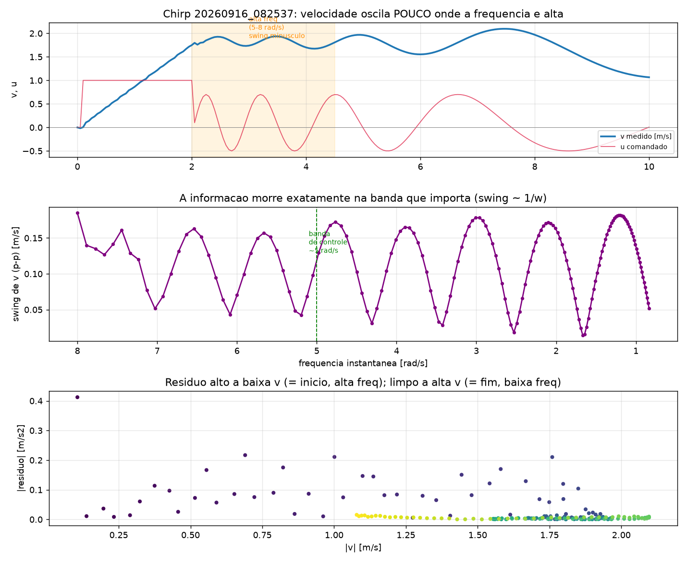

> A lição corrige o item 1 acima: **para um integrador, comando oscilante é a
> excitação errada.** O que informa um integrador é nível sustentado, não
> senoide. Chirp/PRBS valem para plantas com dinâmica própria (polos), não para
> esta.

**11.2 Repetir o ensaio não adiciona nada: o simulador é determinístico.**
Rodamos o ensaio bom 7 vezes. Os sete `car.csv` são **idênticos byte a byte**
(mesmo md5), e o ajuste de cada um dá `std = 0` em todos os parâmetros. Não há
ruído de processo nem de sensor para a média cancelar — o resíduo de 0,02 não é
ruído, é **desajuste determinístico** (a derivada atravessando as transições, já
dissecado acima). Isso reinterpreta o item 3: os ±5% de `a₀` **não** vêm de
rodar de novo, vêm de ensaios em *condições* diferentes (faixas de velocidade
diferentes). Para o controle a conclusão prática continua a mesma — o
controlador verá ±5% de `a₀` ao mudar de trecho — mas você não reproduz esse
espalhamento repetindo o mesmo ensaio.

> **Consequência metodológica:** num simulador determinístico, "mais dados do
> mesmo tipo" tem retorno zero. Informação nova só vem de *condição* nova.

**11.3 A baixa velocidade: não há zona morta de atrito.** A §5.3 descarta
`|v| < 0,1 m/s` por medo de atrito estático. Um ensaio de rampa lenta de `u`
(0 → 0,18) mostrou que **esse medo era infundado nesta cena**: o carro sai do
lugar com `u = 0,003` (breakaway ~nulo) e o modelo `v̇ = K·u − a₀` continua
valendo até `v ≈ 0,04 m/s` — no platô `u = 0,12` a velocidade sobe a exatamente
`0,12 − a₀ = 0,03 m/s²`, e na descida ela pica quando `u` cruza `a₀`. Não há
termo de estático a acrescentar.

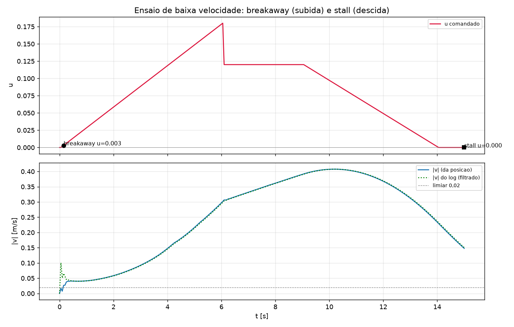

> Isso é o que torna a parada com precisão possível (Parte III): sem zona morta,
> a realimentação zera o erro de posição em vez de esbarrar num patamar de
> atrito. O descarte da §5.3 continua certo *para a identificação* (o `a₀` é mais
> limpo sem os pontos parados), mas o fenômeno que ele temia não existe aqui.

### Sobre baixar o `dt` (não faça)

O `dt = 0,05 s` não está no Python — é o *time step* da cena do CoppeliaSim
(`getSimulationTime()` em [`car.py`](fva_car/car.py) só o lê). Baixá-lo daria
números de identificação mais bonitos, mas **identificaria uma planta que não
existe**: um carro com 5× menos atraso de transporte. Como o CoppeliaSim já foi
validado como fiel ao carro real *neste* `dt`, o atraso de 0,05 s é parte da
planta real e deve entrar no projeto do controle, não ser escondido. A única
razão legítima para mexer no `dt` é casá-lo com a taxa real do loop do hardware,
se ela for diferente de 50 ms — e isso é validação sim↔real, não um botão de
ajuste.

---

# Parte II — Metodologias

As três técnicas usadas neste projeto que valem para qualquer identificação, e
não só para esta planta.

---

## 12. Previsão cega: a única validação que não se engana

Ordem de rigor dos testes, do mais fraco ao mais forte:

| teste | o que o modelo recebe de graça | rigor |
|---|---|---|
| resíduo do ajuste | `v` real a cada amostra | fraco |
| validação cruzada | idem, mas em ensaio separado | médio |
| simulação em malha aberta | só `v(0)` e a sequência de `u` | forte |
| **previsão cega** | idem, em ensaio que **não existia** no ajuste | definitivo |

Os três primeiros você pode enganar sem perceber, ajustando escolhas até o
número ficar bom. O quarto não: o ensaio ainda não foi rodado quando os
parâmetros foram congelados.

Feito aqui com o log `20260915_221122`, usando os parâmetros identificados
antes dele existir:

```
erro rms = 0,012 m/s     erro máx = 0,084 m/s
frenagem medida: dv/dt = -0,594 m/s²   modelo previa: -0,596 m/s²
```

0,3% de erro na desaceleração.

> **Como fazer:** congele os parâmetros num arquivo ou numa variável **antes**
> de projetar o próximo ensaio. Depois rode, e só então compare. Se você
> reajustar "só para conferir", perdeu o teste.

---

## 13. Quando um sensor mente: validação cruzada entre sensores

O `v` do log tinha sinal errado. A correção óbvia parecia ser projetar a
velocidade no eixo do carro, usando o yaw (`th`). Antes de escrever a linha,
conferi o `th` contra **outro sensor que mede a mesma coisa por outro caminho**
— o `w` (velocidade angular) e a própria trajetória:

```
20260915_201815:
   desvio lateral total          = 0,011 m      ← andou reto
   |w| medido (giroscópio) max   = 0,041 rad/s  ← não girou
   |dth/dt| implícito      max   = 32,1 rad/s   ← o th diz que girou 780°/s
```

Três ordens de grandeza de discordância. No instante da inversão de sentido:

```
t=4,15  th=0,711  w=+0,000  y=-7,9992
t=4,20  th=1,414  w=+0,001  y=-7,9992
t=4,25  th=2,823  w=-0,021  y=-7,9989
```

O `th` salta 2,1 rad em 0,1 s enquanto o giroscópio marca zero e o carro não se
desloca lateralmente nem meio milímetro. **O carro não girou — a leitura de
orientação está quebrada.** A causa está em `quaternion_to_yaw()` de
[`fva_car/car.py`](fva_car/car.py): a conversão não bate com a convenção de
eixos deste modelo. Já no repouso, em `t = 0`, ela devolve `th = π/2` para um
carro parado e alinhado.

Se eu tivesse implementado a projeção sem conferir, o sinal de `v` trocaria em
instantes aleatórios — um bug pior que o original, e muito mais difícil de
achar depois.

> **A técnica:** todo sinal derivado tem pelo menos duas rotas de medição.
> Orientação ↔ velocidade angular ↔ curvatura da trajetória. Velocidade ↔
> derivada da posição ↔ rotação das rodas. Antes de confiar num sinal, calcule
> a mesma grandeza pelo outro caminho e veja se batem. Discordância de ordem de
> grandeza é bug, não ruído.

### Escolhendo a fonte certa para o sinal

Descartado o yaw, a fonte usada foi a **rotação das rodas** — que é como um
carro real sabe que está andando de ré:

```python
w_roda = self.sim.getJointVelocity(self.motorL) + self.sim.getJointVelocity(self.motorR)
sentido = np.sign(w_roda) if abs(w_roda) > 1e-3 else self.gear
v = sentido * np.linalg.norm(lin)
```

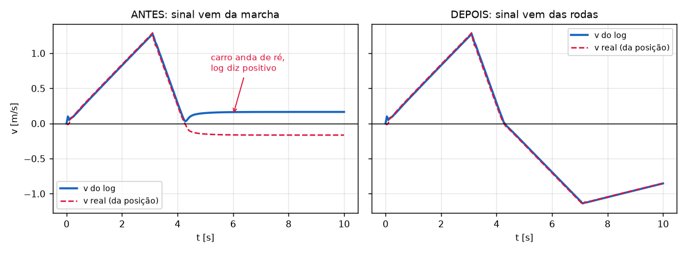

O mesmo tipo de ensaio antes e depois. À esquerda, o carro inverte o sentido em
t ≈ 4,3 s e o log continua reportando velocidade positiva (linha azul), enquanto
a velocidade real reconstruída da posição (vermelha) é negativa. À direita, as
duas coincidem o ensaio inteiro.

Repare na divisão de tarefas: **magnitude** do corpo rígido (imune a
patinação), **sinal** das rodas (imune ao yaw quebrado), e a marcha só como
último recurso com o carro parado. Cada grandeza vem da fonte em que ela é
confiável, em vez de tudo vir de um sensor só.

E a correção foi feita em `get_vel()`, não no `main.py`: o `v` é consumido por
`set_vel`, `set_forward`, `set_reverse`, `stop_mission` e pelo log. Corrigir no
`main.py` arrumaria a cópia e deixaria os outros cinco consumidores errados.

---

## 14. Experimento discriminante: separando efeitos que se parecem

Atrito seco e rampa produzem **exatamente a mesma coisa** num ensaio: uma
desaceleração constante. Nenhum ajuste, por melhor que seja, separa os dois —
eles são matematicamente indistinguíveis com o carro andando só para frente.

```
coast para frente:   v̇ = −(a₀ + g·senθ)
```

Uma equação, duas incógnitas. Não tem saída pelos dados que você já tem.

**A saída é projetar um ensaio onde os dois discordam.** O atrito sempre se opõe
ao movimento, então inverte de sinal com o sentido. A gravidade aponta sempre
para o mesmo lado. Andando de ré:

```
coast de ré:         v̇ = +(a₀ − g·senθ)
```

Agora são duas equações e duas incógnitas, e a solução sai por soma e
subtração:

```
a₀     = (desaceleração_frente + desaceleração_ré) / 2
g·senθ = (desaceleração_frente − desaceleração_ré) / 2
```

### O resultado

```
coast PARA FRENTE:  dv/dt = -0,0986   v_méd = +1,177   desaceleração = 0,0927 m/s²
coast DE RÉ:        dv/dt = +0,0980   v_méd = -0,988   desaceleração = 0,0939 m/s²

a₀     = 0,0933 m/s²   →  f = 0,0095
g·senθ = 0,0006 m/s²   →  θ = 0,003°
```

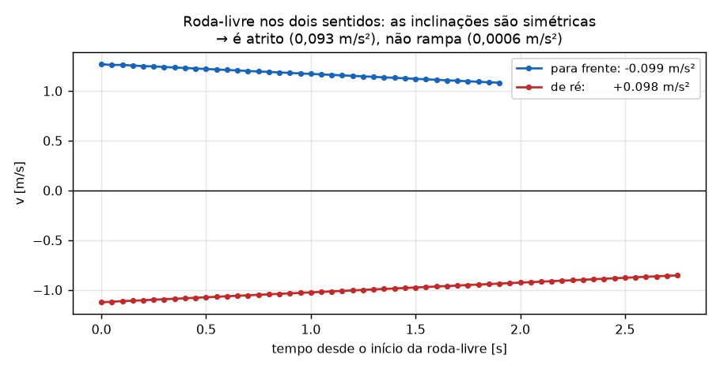

As duas curvas são espelhos uma da outra: ambas caminham para o zero na mesma
taxa. Se houvesse rampa, a de ré seria visivelmente mais inclinada que a da
frente (ou menos, dependendo do lado da descida).

As duas desacelerações batem em 1,3%. **É atrito puro; a pista é plana.** O
termo `mg·senθ` da equação do slide é zero nesta cena, agora por medição e não
por suposição.

### Montando o ensaio de ré (e por que ele quase não funcionou)

Primeira tentativa: segurar `u < 0` até o carro inverter e então soltar. Deu
0,25 s de dado inútil — o carro parou imediatamente.

Dois motivos, e os dois valem como lição:

1. **A velocidade de ré era baixa demais** (0,05 m/s). Para medir uma
   desaceleração de 0,1 m/s² você precisa de velocidade suficiente para ela
   agir por alguns segundos.
2. **A marcha não tinha sido trocada.** Com `gear = +1` e o carro andando para
   trás, o `T = gear*T` de `set_u()` faz a compensação de atrito empurrar para
   **frente** — ou seja, ela vira freio. O carro não estava em roda-livre.

A versão que funcionou usa `set_reverse()`, que freia até parar e engata a ré,
e só então acelera:

```python
if car.t < 3.0:      car.set_u(0.5)     # acelera para frente
elif car.gear == 1:  car.set_reverse()  # freia ate parar e engata a re
elif car.t < 7.0:    car.set_u(0.5)     # acelera de re (gear inverte o torque)
else:                car.set_u(0.0)     # roda-livre de re  <-- a medida
```

> **A técnica:** quando dois efeitos são indistinguíveis, não procure um ajuste
> melhor — procure a condição em que eles se comportam de forma diferente, e
> construa o ensaio em cima dela. Foi o mesmo raciocínio que separou `c` de
> `a₀` (velocidades muito diferentes, seção 3) e que derrubou o polo fantasma
> (faixa de velocidade 5x maior, seção 6.2). É o padrão que mais apareceu neste
> projeto.

---

# Parte III — Do modelo ao controle

O modelo identificado só vale alguma coisa se ele decide um projeto. Aqui ele
decide um: **parar o carro num ponto, com precisão de milímetros.**

---

## 15. Parada com precisão: projetando a partir do modelo

A missão exige parar num alvo. O modelo (§10) diz três coisas que definem o
projeto inteiro:

1. **Planta = integrador puro** (`v̇ = K·u`, arrasto desprezível abaixo de 2 m/s).
   De `u` para posição é `1/s²` — duplo integrador.
2. **Distúrbio `a₀` que troca de sinal com o movimento**, e **some no repouso**
   (§11.3: sem zona morta, `a₀·tanh(v/ε) → 0` quando `v → 0`).
3. **Atraso de um passo (0,05 s)** que custa fase e limita a banda (§11 "O atraso
   de uma amostra").

### O teto de `Kp` sai da fase, não da planta

Para a malha de velocidade (P sobre o integrador, mais o atraso e o filtro
`v_filt` α = 0,6 ≈ τ = 0,033 s), a margem de fase no cruzamento `ωc ≈ Kp` é:

```
ωc = 5 rad/s   →   atraso 14° + filtro 9°    →   margem ~66°   (confortável)
ωc = 8 rad/s   →   atraso 23° + filtro 15°   →   margem ~52°
ωc = 10 rad/s  →   atraso 29° + filtro 18°   →   margem ~43°
```

**`Kp ≈ 5` (cruzamento ~5 rad/s, ~60° de margem).** Confirma o número que a
análise de resíduo tinha antecipado. Acima disso a margem some — e é o atraso,
não a dinâmica da planta, que impõe o teto.

### A arquitetura, e por que cada peça existe

Três decisões, cada uma resolvendo um problema que os ensaios revelaram:

```
vdes = sign(e)·min(V_MAX, Kpp·|e|, √(2·A_freio·|e|))          # perfil de aproximacao
u    = ( Kv·(vdes − v) + a₀·tanh(v/ε) ) / K                    # u direto + feedforward
```

1. **Perfil de velocidade freio-limitado.** A raiz `√(2·A_freio·|e|)` nunca pede
   uma velocidade da qual não dá para frear na distância que resta, então
   **overshoot é impossível por construção**. Um `vref = Kpp·e` ingênuo dava
   9–40 cm de overshoot — o carro pedia velocidade demais e não freava a tempo.
2. **Comando `u` direto (feedback linearization), não incremental.** O
   `u += du·dt` do [`car.py`](fva_car/car.py) `set_vel` é lento demais para
   reverter de acelerar → frear perto do alvo; com o atraso de 1 passo por cima,
   o carro passava batido. Comandar `u` direto reage no mesmo instante.
3. **Feedforward de `a₀`.** Cancela o atrito seco em vez de deixar um integrador
   persegui-lo. Como não há zona morta e `a₀ → 0` no repouso, o carro assenta em
   `u = 0` sem drift — por isso dispensa integrador e o erro final é zero **mesmo
   com `a₀` errado em ±10%**.

### Validação: modelo previu, o CoppeliaSim confirmou

Simulado primeiro no modelo identificado (com o atraso de 1 amostra): 0,0 mm de
erro e 0,0 mm de overshoot, de 0,5 a 5 m de alvo e chegando a 0,8 m/s. Depois
rodado no CoppeliaSim, alvo em `x = −1,0 m`:

```
erro final  = −0,19 mm      (parou em x = −0,99981)
overshoot   =  0,27 mm
assentamento=  3,55 s  (dentro de 5 mm)
descasamento real × modelo:  rms 3,9 mm   max 17,7 mm (transitório)
```

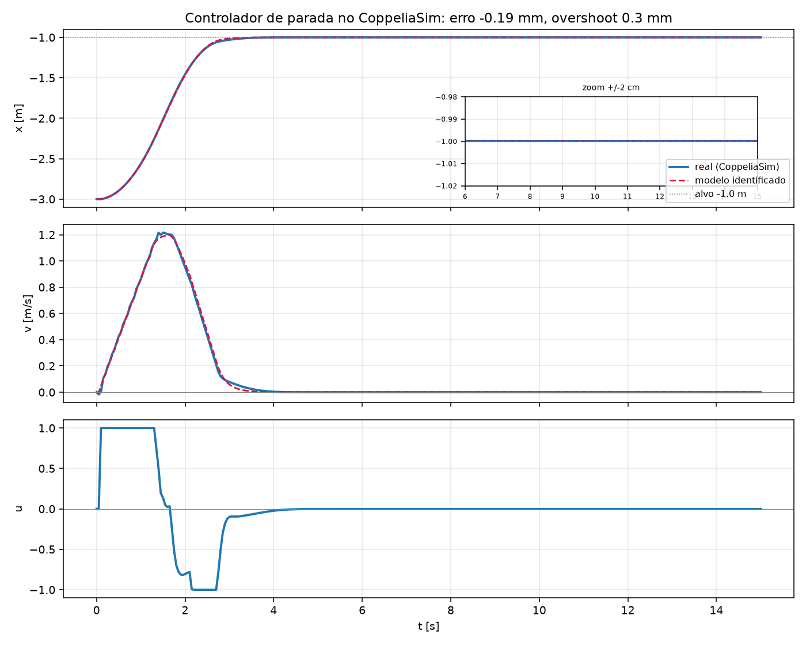

Azul é o carro real no simulador, vermelho tracejado é o modelo recebendo só o
alvo. Sub-milímetro de erro, sem overshoot — **o modelo de três números projetou
um controlador que para o carro onde ele mandar.** É o retorno de toda a
identificação: não o ajuste bonito, mas a decisão de projeto que ele permitiu
acertar de primeira.

> Repare que não há integrador e não há termo derivativo realimentado (§10 já
> avisava: `car.a` é derivada filtrada, realimentá-la injeta atraso). O que faz o
> trabalho é o **feedforward** do distúrbio que a identificação mediu, mais um
> perfil que respeita o limite físico de frenagem. Modelo bom vira controle
> simples.

### Na rampa: o `a₀` some no repouso, o `g·senθ` não (aberto para projeto)

O controlador acima dispensa integrador por um motivo específico do plano: o
distúrbio (`a₀`) **some no repouso** (`a₀·tanh(v/ε) → 0` quando `v → 0`, §11.3),
então o carro assenta em `u = 0` sem drift. **Na rampa esse argumento quebra:** o
`g·senθ` (§7.3) está lá com o carro parado — a gravidade não desliga. Sem
compensá-lo, o carro **escorrega ladeira abaixo em regime**. Segurar posição numa
ladeira exige uma de duas rotas:

**Rota A — feedforward, medindo o θ.** Somar `g·senθ` ao comando, como já se faz
com o `a₀`. O θ vem do **IMU** do carro real
([`imu.py`](../veiculo_real/fva_car/imu.py)). Pegadinha: o acelerômetro **não
separa a gravidade da própria aceleração do carro** em movimento — o eixo
longitudinal mede `g·senθ + v̇` misturados. A saída padrão é **fundir giroscópio
+ acelerômetro** (giro: taxa de pitch, boa no curto prazo mas deriva;
acelerômetro: ângulo absoluto, bom no longo prazo mas ruim em movimento) num
filtro complementar/Kalman. É o que qualquer estimador de atitude de IMU faz.

**Rota B — feedback, sem medir θ.** Tratar `g·senθ` como **distúrbio** e deixar um
integrador (ou um observador de distúrbio) absorver: o controle vê "algo me segura
0,6 m/s²" e compensa sem saber que é ladeira. Não precisa de sensor, mas só reage
**depois** que o erro aparece, e traz atraso e risco de windup.

| | Rota A — feedforward (mede θ) | Rota B — feedback (integrador/observador) |
|---|---|---|
| precisa de sensor | sim (IMU + fusão) | não |
| reage | na hora, antes do erro | só depois do erro aparecer |
| custo | complexidade do IMU | atraso + risco de windup |

> **Decisão em aberto (para o hardware):** medir o θ e fazer feedforward, ou
> deixar o controle tratar como distúrbio. Depende de **quanta ladeira** você
> espera (lembrando o limite de subida a `u = 1`: `K = a₀ + g·senθ` dá
> `θ ≈ 5,3°`, acima disso o carro a fundo nem sobe) e de **se precisa parar
> parado** numa inclinação. No plano, nenhuma das duas é necessária — por isso o
> §15 as dispensou.

---

## 16. Tabela de símbolos e comandos

| símbolo | nome | unidade | valor aqui |
|---|---|---|---|
| `v` | velocidade longitudinal (com sinal) | m/s | — |
| `v̇`, `ẍ` | aceleração | m/s² | — |
| `u` | comando (`car.set_u`), em unidade de aceleração | m/s² | −1 a +1 |
| `K` | ganho: fração do comando que vira aceleração | — | 1,00 |
| `c` | coeficiente de arrasto (efeito ∝ v²) | 1/m | 0,00425 |
| `a₀` | atrito seco (efeito constante) | m/s² | 0,095 |
| `τ` | constante de tempo (**não existe** nesta planta) | s | — |
| `θ` | inclinação da pista | grau | 0,003 (plana) |
| `f` | coeficiente de rolamento, `= a₀/g` | — | 0,0095 |
| `m` | massa do carro | kg | 6,3 |
| `g` | gravidade | m/s² | 9,81 |
| `Fx` | força de tração das rodas | N | `m·u` |
| `ρ` | densidade do ar | kg/m³ | 1,2 |
| `Cd·Af` | arrasto × área frontal, `= 2mc/ρ` | m² | 0,045 |
| `Td` | atraso de um passo de amostragem | s | 0,05 |

```bash
python analise_log.py                           # inspeciona o log mais recente
python analise_log.py logs/AAAAMMDD_HHMMSS      # inspeciona um log especifico
python analise_log.py --tmax=8                  # descarta o final do ensaio
python identifica.py --tmax=8 --ignora=2026...  # ajuste em etapas + validacao
python melhora.py                               # analise de residuo + SINDy
python figuras.py                               # regera as figuras deste .md
```

---

## 17. Modelo canônico — resultado final consolidado

O modelo abaixo é o oficial do projeto. Ele sobreviveu a previsão cega em todo o
envelope testado; nada nas seções de validação o alterou (§7.1–7.4 apenas o
confirmaram e esticaram o envelope).

### A equação completa

```
v̇ = K·u − c·v·|v| − a₀·sign(v) − g·senθ
```

O último termo, `g·senθ`, é zero na pista plana e só entra quando há inclinação
(§0.2, §7.3). Todos os outros parâmetros são **da planta** e **não mudam com a
cena** — trocar de piso é somar o termo de gravidade, não re-identificar (§7.3).

### Os parâmetros

| parâmetro | valor | unidade | como foi fixado / validado |
|---|---|---|---|
| `K₊` | 1,00 | — | trechos com motor `u>0`; §3, §7.4 |
| `K₋` | 1,00 | — | frenagem a 4 m/s; §7.2 |
| `c` | 0,00425 | 1/m | coastdown limpo até 5 m/s; §3, §7.1, §7.4 |
| `a₀` | 0,096 | m/s² | roda-livre; §3, §14 |
| `θ` (plana) | 0 | grau | discriminante frente×ré; §14 |
| `θ` (rampa) | ≈3,7 | grau | `g·senθ ≈ 0,63 m/s²`; coast e acel na subida; §7.3 |
| `Td` | 0,05 | s | atraso de um passo de amostragem; §11 |

`f = a₀/g = 0,0098` (rolamento). `Cd·Af = 2mc/ρ = 0,045 m²` (perdas ∝ v², não é
ar de verdade — o sim não tem aerodinâmica; §10).

### Envelope de validação (previsão cega, malha aberta)

| condição | faixa | erro |
|---|---|---|
| comando `u` | −1 a +1 | — |
| velocidade | 0 a ~8 m/s | rms < 3% do fundo de escala |
| coastdown alta velocidade | até 5 m/s | rms 0,018 m/s (§7.1) |
| frenagem | de 4 m/s | rms 0,027 m/s (§7.2) |
| rampa (acel subindo) | θ≈3,7° | erro 0,010 m/s² (§7.3) |
| parada com precisão | alvo 0,5–5 m | erro < 0,2 mm (§15) |

### Forma reduzida para o controle (0 a 2 m/s)

O termo `c·v²` vale ≤ 0,017 m/s² nessa faixa — desprezível. O carro é um
**integrador puro com distúrbio de atrito**:

```
v̇ = 1,00·u − 0,096·sign(v)        →       V(s)/U(s) = 1/s
```

Consequências de projeto em §10 e §15 (planta tipo 1, teto de `Kp≈5` vindo do
atraso `Td`, feedforward de `a₀` no lugar de integrador).
